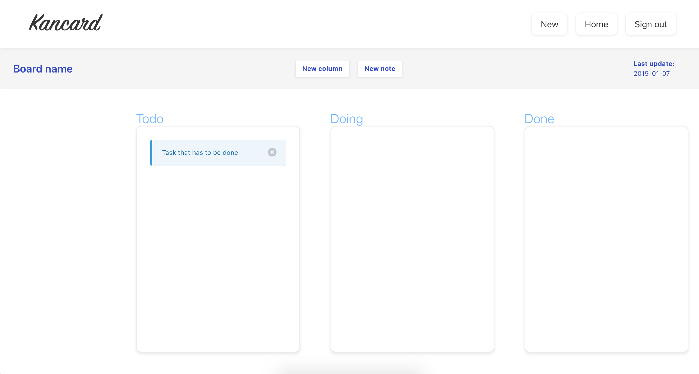
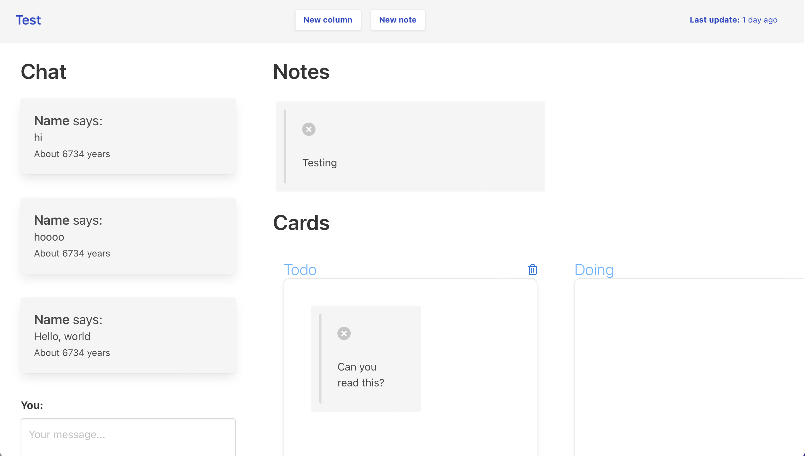

# Kancard

- Ruby version
  - 3.0.0

- System dependencies
  - Bundler
  - Npm

## Issues / room for improvment

- The owner value & owner id is being passed from the client to the server as parameter, this can easily be forged by the client in order to fool the server. Instead, the two values should be handled in the controller and injected to the BoardsController#create action.

- Notes does not resize very well when switching between the Notes column & Cards column.

- `./db/schema.rb` lacks stronger types, some columns should not be nullable & other columns should have a default value. Other columns would be much better if it was typed as Array instead of String.

- The chat text field doesn't get cleared when sending a message.

## Requirements in production

- Redis

### Start redis

#### macOS

`brew services start redis`

## Getting started

- `bundle install`
- `yarn`

### Development server

`RAILS_ENV=development rails server`

## Screenshot

